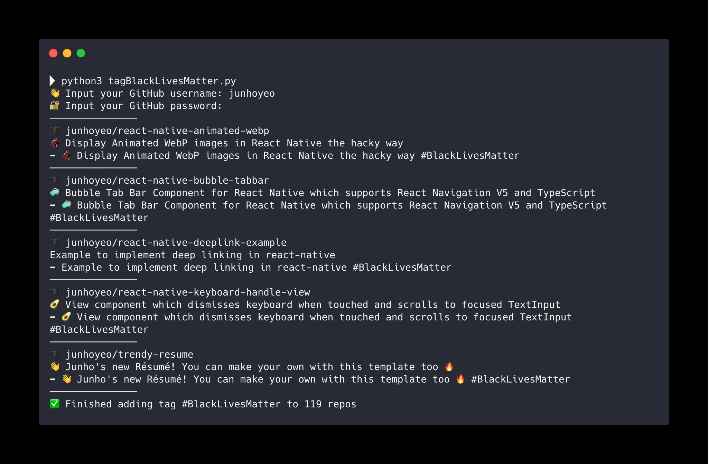

<p align="center">
  
</p>

> Python3 script that adds `#BlackLivesMatter` tag on all your GitHub project descriptions.

## 🏴 Usage
Clone this repo, install [PyGithub](https://github.com/PyGithub/PyGithub), run the script [tagBlackLivesMatter.py](./tagBlackLivesMatter.py).<br />
It will prompt for user credentials and then automatically start running.

```bash
# Python3 and PyGithub is required
pip3 install PyGithub

git clone https://github.com/junhoyeo/TagBlackLivesMatter
cd TagBlackLivesMatter

python3 tagBlackLivesMatter.py
```



## 📖 Learn More

- [Black Lives Matter: Home](https://blacklivesmatter.com/)
